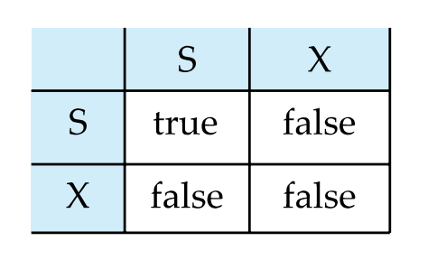
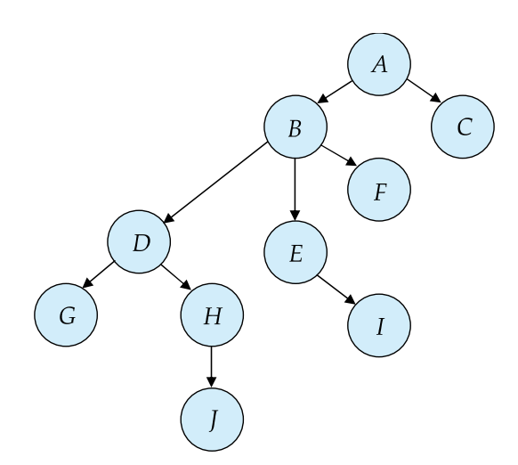
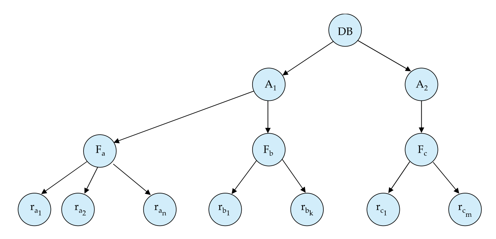
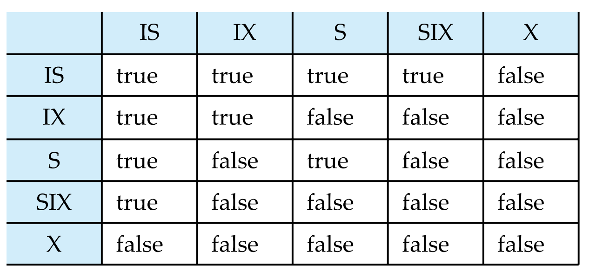

이번 장은 트랜잭션의 동시성을 제어하기 위한 기법들에 대해 알아본다.
## Lock-Based
고립성 구현을 위한 대표적인 방법은 **잠금(Lock)**이 있다. 
잠금에는 두가지 모드가 있다.
> **Shared(S)-mode**: Lock-S로 표기, 데이터는 읽기만 가능하다. 
> **Exclusive(X)-mode**: Lock-X로 표기, 데이터는 읽기와 쓰기 모두 가능하다.

아래 행렬의 규칙에 따라 다수의 트랜잭션이 동시에 하나의 데이터 항목을 동시에 읽을 수 있게 하고, 
한 번에 하나의 트랜잭션만 갱신을 위한 접근을 하도록 제한한다. 
 

즉, 한 데이터에 대해 독점적 잠금은 한 트랜잭션만 가질 수 있고, 
공유적 잠금은 여러 트랜잭션이 가질 수 있다. 

만약 이미 호환 되지 않는 잠금이 걸려 있는 항목에 잠금을 요청하면, 
해당 트랜잭션은 그 잠금이 해제될 때까지 **대기(wait)**한다.

> - **Deadlock(교착상태)** 
>: 호환되지 않는 잠금 요청으로 대기가 이어져 더이상 진행할 수 없는 상태 
> Deadlock은 abort해야하지만, 일관성이 결여되는 것보다 낫다.

 

> - **Starvation(기아 상태)** 
>: 특정 트랜잭션의 우선순위가 낮아 데이터를 할당 받지 못하는 상태 
> 트랜잭션이 X-Lock을 요청하지만, 다른 트랜잭션이 S-Lock을 계속 요청하면 결코 X-Lock을 얻을 수 없다.

## 2PL(two-phase locking protocol)
**직렬 가능성**을 보장하기 위해 2단계 잠금 규약을 사용한다. 
> 1. 증가 단계: 트랜잭션이 잠금만 얻고 해제할 수 없다. 
> 2. 감소 단계: 트랜잭션이 해제만 할 수 있고 잠금할 수 없다. 

트랜잭션의 증가단계의 마지막 부분을 **잠금지점**이라고 하고,  
이 지점을 기준으로 직렬적으로 정렬할 수 있다.

그러나 (basic) 2PL 역시 **교착 상태를 막을 수 없다**는 것을 기억하자. 
이외에도 더 강한 규칙을 가진 2PL이 있다.
> - **strict 2PL** 
독점적 잠금을 커밋할 때 까지 유지한다. 
**비연쇄성+직렬 가능성 보장**
 
> - **rigorous 2PL** 
공유/독점적 잠금을 커밋할 때 까지 유지한다. 
**비연쇄성+커밋 순서에 따른 직렬가능성 보장** 

위 규약들 역시도 모두 교착상태를 방지할 수는 없다.  
(strict 2PL(혹은 conservative 2PL)이라고 부르는 규약은 데드록을 방지할 수 있다.) 

### 트리 규약
트리 규약은 **Lock-X만을 사용**해서 데이터의 순서를 그래프로 표현하며 다음과 같은 규칙을 따른다.
> 트랜잭션 T의 첫번째 잠금은 어떤 데이터 항목에도 가능하다.
> 트랜잭션은 Q의 부모에 해당하는 항목에 잠금을 걸고 있는 경우에만 Q에 잠금을 걸 수 있다.
> 데이터 항목의 잠금은 언제든지 해제할 수 있지만, 잠금을 해제한 항목을 다시 잠금할 수는 없다.

트리규약은 **충돌 직렬가능성을 보장하고 데드록을 방지**한다. 
그러나 2PL과 달리, 언제든지 해제할 수 있으므로, 비연쇄성과 복구성(recoverable)을 만족하지 못한다. 

## Deadlock Prevention
데드록을 예방하는 방법은 두가지가 있다.: 
 1. 미리 필요한 잠금을 요청하거나, 
 2. 교착상태를 유발할 거 같으면 대기하는 대신 트랜잭션을 대신 롤백하는 것이다.

1의 경우는 두가지 방법이 있다. 
>바로 위에서 언급했듯이 교착 상태를 방지하는 방법은 트리규약이 있다. (graph based protocol) 
: 데이터의 부분 순서를 사용하는 것 
>또 다른 방법으로는 트랜잭션을 실행하기 전에 미리 잠금을 걸어 놓는것이다. (pre-Declaration) 
> 그러나 이러한 방법은 어떤 데이터를 잠금을 걸어야 하는지 미리 알기 어렵고, 
 데이터 항목의 이용 효율이 떨어진다는 단점이 있다.

2를 구현하는 방법은 **선점과 트랜잭션 롤백**을 이용하는 것이다. 이를 이용한 기법은 다음과. 같다.
>1. **Wait-Die**: 비선점식 기법.  
> \- 더 최근에 실행된 T1이 데이터 잠금을 가지고 있을 때,  더 오래된 T2가 잠금을 요청하는 경우 T1은 wait한다. 
> \- 반면, 먼저 실행된 T1이 데이터 잠금을 가지고 있을 때,  더 최근의 T2가 잠금을 요청하는 경우 T2는 죽는다.(rollback)
>2. **Wound-Wait**: 선점식 기법.  
> \- 더 최근에 실행된 T1이 데이터 잠금을 가지고 있을 때,  더 오래된 트랜잭션 T2가 잠금을 요청하는 경우 T2는 T1을 Rollback시킨다.(T2가 T1을 죽인다.) 
> \- 반면, 먼저 실행된 T1이 데이터 잠금을 가지고 있을 때,   더 최근의 트랜잭션 T2는 기다린다.(wait) 

## Multiple Granularity
모든 트랜잭션은 전체 데이터에 대해 접근할 수도 아닐 수도 있다. 
몇개의 레코드에만 접근할 경우, 데이터베이스 전체에 대한 잠금을 이용한다면 동시성을 잃을 수 있다. 

이를 위해 데이터베이스를 계층적으로 나누고 여러 단계의 **세분도(granularity)**를 제공할 필요성이 있다. 
이것을 표현하기 위해, 트리로 나타내지만 앞서 언급한 tree protocol과 다르다는 것을 기억하자. 
계층의 성질을 가지므로 하위 계층은 상위 계층에 포함된다. 
이는 **암묵적인 잠금(implicity lock)**의 개념으로 확장된다. 

### Intention lock mode
**의도잠금(Intention Lock Mode)**는 한 노드의 명시적인 잠금(일반적인 잠금을 일컫는다)을 걸기 전에 
그 노드의 모든 조상 노드에 걸게 하는 잠금이다. 
의도잠금은 다음과 같은 모드가 있다.
>IS(intention-shared mode): 그 노드가 포함된 단계보다 낮은 단계에서 공유 잠금. 
>IX(intention-exclusive mode): 그 노드가 포함된 단계보다 낮은 단계에서 독점적 혹은 공유모드 잠금. 
>SIX(shared and intention-exclusive mode): 그 노드를 루트로 하는 서브트리에 S를 걸고, 그 하위단계에 IX를 건다. 

이를 이용한 **다중 세분도 잠금 규약(multiple-granularity locking protocol)**은 다음과 같은 규칙을 만족해야한다.

> - 호환 행렬을 준수해야 한다.
> - 트리의 루트에 먼저 잠금을 걸어야 한다.
> - 부모가 IX, IS 잠금이 걸린 경우에만 해당 노드에 S,IS를 할 수 있다.
> - 부모가 IX, SIX 잠금이 걸린 경우에만 해당 노드에 X,IX, SIX를 할 수 있다.
> - 어떠한 잠금도 해제하지 않았을 경우에만 잠금을 할 수 있다. (2PL의 증가규약을 떠올려라.)
> - 데이터의 자식 중 하나라도 잠금이 걸려 있지 않아야 잠금을 해제할 수 있다.

다중 세분도 잠금 규약 역시 2PL처럼, root-to-leaf로 잠금을 걸고, leaf-to-root로 잠금을 해제할 수 있다.
 

**References** 
Database Systems, Abraham Silberschatz, Henry Korth and S. Sudarshan