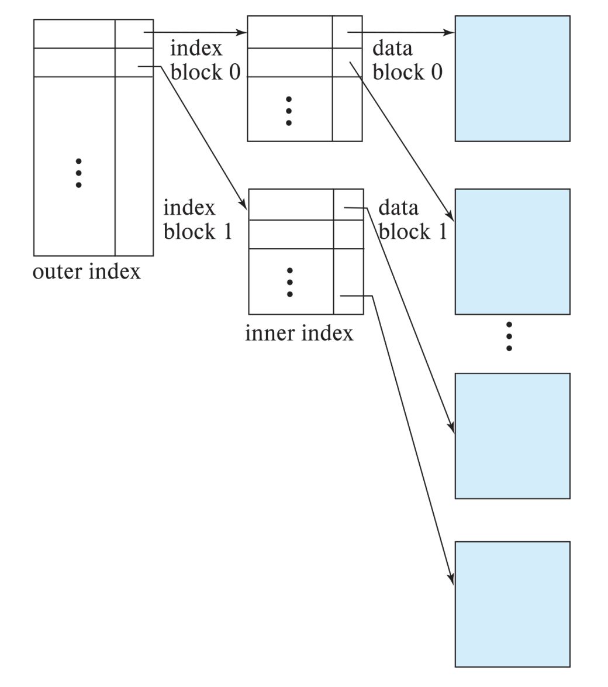
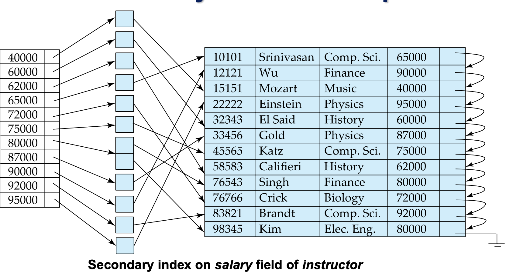

대부분의 query는 레코드의 극히 일부분의 튜플이나 어트리뷰트를 요하는 경우가 많다. 
따라서 수많은 레코드들 중에서 무분별하게 데이터를 찾는 것은 비효율 적이다. 
**인덱스**는 이를 보안하기 위한 대표적인 방법이다. 

인덱스는 대표적으로 순서 인덱스와 해시 인덱스 두가지 종류가 있다. 
**순서 인덱스**는 말그대로 값에 대해 정렬된 순서로 있는 인덱스, 
**해시 인덱스**는 버켓의 범위 안에서 값이 일정하게 분배되어 있는 인덱스이다. 
버켓은 해시함수에 종속된다. 

## 순서 인덱스
파일이 연속적인 순서로 되어 있어 그 파일을 검색키로 사용하는 인덱스를 **클러스터링 인덱스(기본 인덱스)**라고 한다. 
클러스터링 인덱스는 주 키인 경우가 많지만 반드시 그러할 필요는 없다. 

파일이 연속적인 순서와 다른 순서로 구성되는 검색 키의 인덱스를 **비클러스터링 인덱스(보조인덱스)**라고 한다. 
순서 인덱스는 밀집 인덱스와 희소 인덱스가 있다. 

- **밀집 인덱스(dense index)**: 파일에 있는 **모든 검색 키**값에 대해 나타난다. 
검색 키 값과 그 검색 키 값의 첫 번째 데이터 레코드에 대한 포인터를 포함한다. 
- **희소 인덱스(sparse index)**: 검색 키 값에 **일부 몇 개**만 나타난다. 
희소 인덱스는 오직 릴레이션이 검색 키로 정렬되어 저장될 때,  즉 인덱스가 클러스터링 인덱스인 경우 사용될 수 있다. 
검색 키 값과 그 검색 키 값의 첫 번째 데이터 레코드에 대한 포인터를 포함한다. 
찾고자 하는 검색 키 값보다 작거나 같은 것 중 가장 큰 검색 키 값을 가지는 인덱스 엔트리를 찾아야 한다. 
해당 레코드를 시작으로 파일에서 원하는 레코드를 찾을 때까지 포인터를 따라간다.

밀집 인덱스는 빠른 탐색시간이 장점이지만 많은 공간을 차지하는 단점이 있다. 
희소 인덱스는 삽입과 삭제에서 유지 부담이 적다. (레코드가 삭제되어도 새로 인덱스를 구성할 필요가 없기 때문) 

### 다계층 인덱스
일반적인 밀집탐색은 이진 검색을 통해 수행되는데 수행시간은 $\lceil \log_2 b \rceil$이다. 
10,000개의 블록으로 구성된 인덱스의 경우 14개의 블록읽기가 수행되어야 한다.(2^14>10000) 
이는 경제적이지 못하다. 

이 문제를 해결하기 위해, 내부 인덱스를 도입한 다단계 인덱스를 사용한다. 
내부 인덱스는 기본 인덱스에 대한 희소 외부 인덱스를 말한다. 

이에 따라 최상위 노드 부터 하나씩만 데이터 블록을 읽게 된다. 
앞서 14개의 인덱스 블록을 읽어야하는 것과 대조된다. 

## 인덱스 갱신
### 삽입
- 밀집인덱스 
 (1) 검색 키 값이 인덱스에 없다면 인덱스의 적당한 위치에 삽입한다. 
 (2) 그렇지 않다면, 
  &emsp;(a) 똑같은 검색 키 값을 가지는 모든 레코드를 가리키는 포인터를 저장하고 있다면  
  &emsp; 새로운 레코드에 대한 포인터를 추가한다. 
  &emsp;(b) 그렇지 않다면 인덱스 엔트리는 검색 키 값을 가지는 첫번째 레코드에 대한 포인터만 저장하고 있다.  
  &emsp;그러면 시스템은 같은 검색 키를 가지는 다른 레코드 뒤에 삽입된 레코드를 놓는다. 

- 희소인덱스   
새로운 블록을 생성한다면 첫 번째 검색 키 값을 인덱스에 삽입한다. 
새로운 레코드가 기존 블록의 가장 작은 키라면 기존 블록을 가리키는 인덱스 엔트리를 갱신한다. 
그렇지 않다면 인덱스를 바꾸지 않는다.

### 삭제
- 밀집인덱스 
(1) 삭제된 인덱스가 특정 검색 키 값을 가지는 유일한 레코드라면 대응되는 인덱스 엔트리를 삭제한다. 
(2) 그렇지 않다면, 
&emsp;(a) 인덱스 엔트리가 같은 검색 키 값을 가지는 모든 레코드를 가리키는 포인트를 저장하고 있다면  
&emsp;인덱스 레코드로부터 삭제된 레코드에 대한 포인터를 삭제한다. 
&emsp;(b) 삭제된 레코드가 검색 키 값을 가지는 첫번째 레코드였다면 
&emsp;시스템은 인덱스 엔트리가 다음 레코드를 가리키도록 갱신한다. 

- 희소인덱스 
(1) 인덱스가 삭제된 레코드 검색 키 값을 가지는 인덱스 엔트리를 포함하고 있지 않다면 그대로 둔다. 
(2) 그렇지 않다면, 
&emsp;(a) 해당 레코드가 유일한 레코드라면, 인덱스 레코드를 다음 검색 키로 교체한다. 
&emsp;이미 해당 값이 인덱스 엔트리에 있으면 엔트리는 교체되는 대신 삭제한다. 
&emsp;(b) 똑같은 검색 키를 가지는 다음 레코드를 가리키도록 한다. 

## 보조 인덱스
보조 인덱스는 모든 검색 키 값과 모든 레코드에 대한 포인터를 가지는 엔트리로 된 **밀집 인덱스**이어야 한다. 
**보조 인덱스는 희소 인덱스일 수 없다.** 
파일을 연속적인 접근을 할 수 없어 중간 검색 키 값을 가지는 레코드를 찾는 것이 불가능하기 때문이다. 
따라서 보조인덱스는 **모든 레코드에 대한 포인터를 포함**해야 한다. 

| | 주요 특징 | 권장 사용 케이스 |
| :--- | :--- | :--- |
| **장점** | 읽기 속도 향상, 정렬 성능 최적화 | **WHERE**절에 자주 등장하는 열, 카디널리티 높은 열 |
| **단점** | 저장 공간 차지, 쓰기속도 저하, 오버헤드 발생 | 데이터 변경이 잦은 테이블, 중복 값이 너무 많은 열 |

 
다음 장에서는 어떤 형식으로 인덱스 파일을 구성할 수 있는지 알아본다.

**References** 
Database Systems, Abraham Silberschatz, Henry Korth and S. Sudarshan