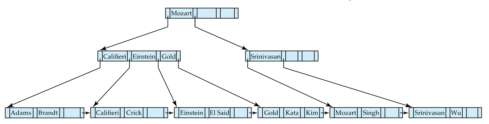
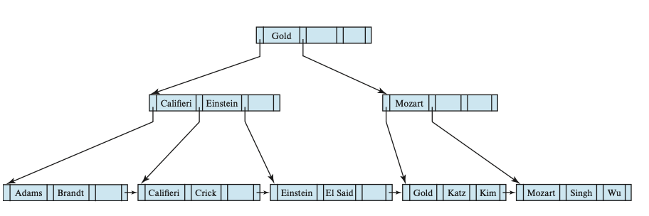
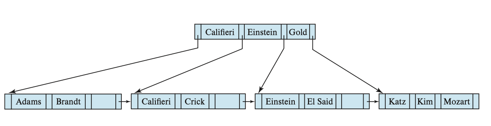
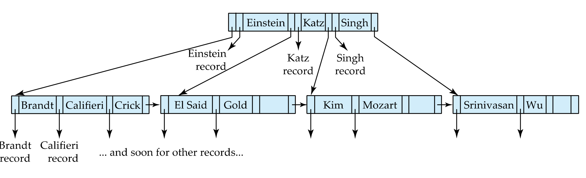

가장 대표적인 인덱스 구조인 B+ 트리 인덱스에 대해 알아보자. 
B+ 트리는 트리의 루트에서 각 단말 노드까지 모든 경로의 길이가 같은 **균형 트리** 형태이다. 

## B+ 트리의 구조
노드별 값의 개수는 다음과 같다.
>
**루트 노드 (Root)**: $1$개 ~ $M - 1$개 
**중간 노드 (Internal)**: $\lceil M/2 \rceil - 1$개 ~ $M - 1$개  
**단말 노드 (Leaf)**: $\lceil (M-1)/2 \rceil $개 ~ $M - 1$개  
>

중간 노드의 포인트 값의 개수는 $\lceil M/2 \rceil $개 이상의 포인터를 가져야 한다.  
즉,절반 이상의 포인터를 가져야한다. 
또한, 한노드의 포인터 수는 팬아웃(fanout)이라고 한다. 

### B+ 트리에 대한 질의
B+ 트리의 레코드가 N개라고 할 때, 질의 수행 시간은 다음과 같다. 
>$\lceil \log_{n/2}(N) \rceil$) 

B+ 트리는 범위질의에 유용하다.  
단말노드가 연결리스트로 되어 있어, 단계적으로 단말 노드를 검사하여 범위를 탐색한다. 

## B+ 트리 갱신
### 삽입
단말 노드에 값을 넣을 때 일반적인 경우는 검색 키가 순서를 유지하도록 조정하여 삽입하면 된다. 
그러나 어떤 경우에는 트리의 구조를 유지하기 위해 노드를 분할하거나 유착해야 할지도 모른다. 

분할하는 방법은 n개의 검색 키 값을 가질때, 처음 $\lceil \ n/2 \rceil$)개는 원래 노드에 두고, 
나머지는 새 노드에 놓는 것이다.[^1] 

B+ 트리 삽입의 일반적인 원칙은 삽입이 일어나는 노드를 결정하는 것이다. 
이에 따라 분할이 일어난다면, 분할로 만들어진 새로운 노드를 가르키는 검색 키와 포인터를 노드의 부모 노드에 삽입한다.  
이것이 또 다른 분할을 야기하면, 트리 위로 가면서 재귀적으로 삽입을 수행한다. 
이는 분할을 멈추거나, 새로운 루트가 나타날 때까지 반복한다. 

### 삭제
단말 노드에 값을 삭제할 때 일반적인 경우는 검색 키를 찾아 삭제하기만 하면 된다. 
단, 이때도 트리의 구조가 유지될 수 있도록 해야한다. 

그렇다면 트리의 구조가 유지될 수 없게 되면 어떻게 해야 할까? 

단말노드는 최소 $\lceil (M-1)/2 \rceil $개를 가져야 한다는 것을 기억하자. 
따라서 이를 보장할 수 없으면, 형제 노드[^2]와 **합병**(유착이라고도 부름)되거나  
각 노드가 적어도 반을 채워지는 것을 보장하기 위해 **재분배**되어야 한다. 

예제를 통해 살펴보자, 

위와 같은 B+ 트리에서 'Srinivasan'를 삭제한다고 해보자. 
n=4이므로 단말노드는 최소 2개를 가져야한다.  
그러나 삭제로 인해 마지막 단말 노드가 하나의 값만 가지고 있다. 

먼저, 이웃노드와 합병을 시도한다. 이에 따라 [Mozart, Singh, Wu]의 노드가 만들어진다. 
또한, 내부 노드에 있는 'Srinivasan' 역시 삭제된다.  
이에 따라 포인터는 하나만 남게 되므로, 합병 혹은 재분배 되어야 한다. 
그러나 형제 노드 [Califieri, Einstein, Gold]는 이미 4개의 포인터를 가지기 때문에 합병할 수 없다.  
(포인터가 한개 남은 기존 노드와 형제노드는 4개의 포인터를 가져 합병시 5개를 가지게 되어 overfull.) 

따라서 합병이 아닌, 재분배가 이뤄져야 한다. 
따라서 부모 노드를 포함하여 재분배를 하고, underfull 햇던 노드가 최소 포인터를 가질 수 있게 분배한다. 

예제에 따르면, 더 이상 Mozart는 이를 통해 더 이상 구분자가 될 수 없고,
아래로 내려보내 오른쪽 노드의 구분자가 된다.
이에 따라 Gold는 새로운 구분 기준 키가 된다.(루트 노드로 올라간다.)[^3]

이에 따른 트리의 형태는 다음과 같다.

여기서 'Singh', 'Wu'를 삭제하면, [Gold, Katz, Kim], [Mozart]는 재분배된다. 
따라서 [Gold, Katz], [Kim, Mozart]로 재분배되고, 부모노드는 'Mozart'에서 'Kim'으로 갱신된다. 

단말노드에서 삭제되는 값과 달리 구분되는 값은 비단말 노드에서 남아 있을 수도 있다. 
위 상황에서 'Gold'를 삭제 했을 때 아래와 같은 결과가 나타날 수 있다. 

## B 트리 인덱스
일반적으로 B+ 트리 인덱스를 사용하지만, B 트리 인덱스를 사용할 수 있다. 
B 트리는 유사하지만, 검색 키가 차지한 중복된 저장 공간을 제거할 수 있다. 

그러나 비단말 노드에 나타내는 검색 키는 B 트리의 다른 노드에 나타나지 않기 때문에, 
비단말 노드에 각 검색키를 위한 부가적인 포인터 필드를 포함해야 한다. 
이 포인터는 파일 레코더나 관련된 검색 키를 위한 버켓을 가르킨다. 

B+ 트리와 달리 B 트리는 어떤 값을 검색하기 위해 비단말 노드를 반드시 모두 건널 필요는 없을 수 있다. 
따라서 검색 질의의 경우 B+ 트리보다 유리할 수 있다.(일부의 동등질의에서)

앞서 말했듯이 각 검색 키는 추가적인 포인터를 가지므로, B 트리는 더 적은 팬아웃을 가질 것이다.
이에 따라 트리의 높이는 더 높아질 수 밖에 없다.
이에 따라 검색 질의도 반드시 B+ 트리보다 빠르다고 할 수 없는 것이다.

**References** 
Database Systems, Abraham Silberschatz, Henry Korth and S. Sudarshan

[^1]: 분할의 방법은 전공서나 논문에 따라 다르게 나타나기도 한다...
[^2]: 형제노드란, 같은 레벨 선상에서 같은 부모로 부터 나온 노드들을 일컫는다.
[^3]: In our example, the value “Mozart” separates the two pointers and is present in the right sibling after the redistribution. Redistribution of the pointers also means that the value “Mozart” in the parent no longer correctly separates search-key values in the two siblings. In fact, the value that now correctly separates search-key values in the two sibling nodes is the value “Gold”, which was in the left sibling before redistribution.