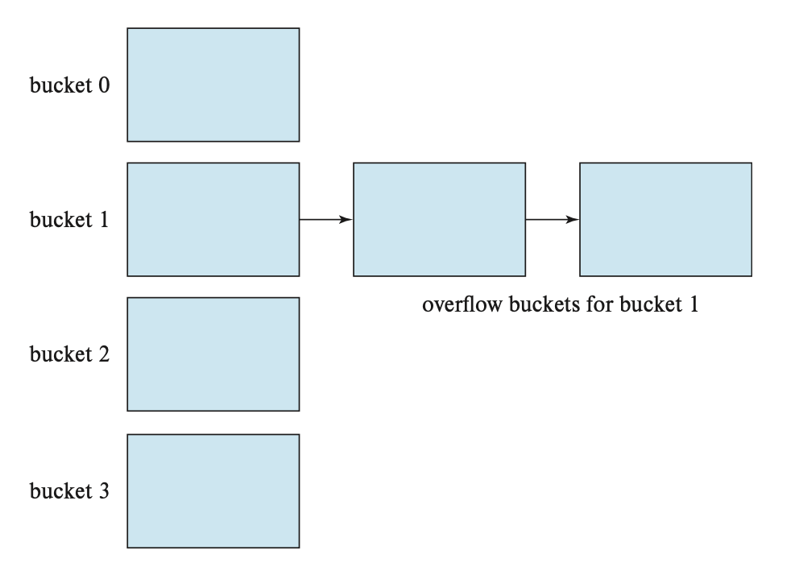

## Hash Index

해싱은 버켓을 통해 구축된다. 
버켓은 복수의 레코드를 저장할 수 있는 저장 공간 단위를 일컫는다. 
해시함수는 특정 값 K를 버켓 B에 대응하는 것을 말한다. 
대표적으로 **overflow chain**을 사용한다. 

버켓에 레코드를 저장할 공간이 가득찼다면 버켓 오버플로가 발생했다고 한다. 
버켓 오버플로는 오버플로 버켓을 통해 처리된다. 
오버플로 버켓은 연결리스트를 통해 구성된다. 

## 복합 검색 키 인덱스
다중 키 인덱스를 사용하는 것은 다음과 같은 상황에 장점이 있을 수 있다.

검색 키 (dept_name, salary)에 대해 다음과 같은 질의를 한다고 해보자

> 1 dept_name이 AI인 사람을 찾아라 
> 2 dept_name이 AI, salary가 1000인 사람을 찾아라. 
> 3 dept_naem이 AI, salary가 1000보다 큰 사람을 찾아라 
> 4 dept_name이 AI보다 크고, salary가 1000보다 큰 사람을 찾아라 

1의 경우 (AI,-inf.) (AI,+inf.)에 대한 범위 질의가 가능하고, 
2의 경우 (AI, 1000)에 대한 동등 질의가 가능하고, 
3의 경우 (AI, 1000+) 에 대한 범위 질의가 가능하다. 

위의 경우에는 복합 키에 따른 효율적인 질의가 가능하다. 

반면 4의 경우, 효율적인 질의가 어려울 수 있다. 
AI보다 큰 dept_name을 가진 레코드가 서로 다른 블록에 있을 수 있고,  
레코드의 순서에 따라 많은 I/O가 이뤄질 수 있기 때문이다. 

즉, **복합 키의 첫번째 속성**에 대한 동등 조건이 아니라 범위 질의의 경우 비효율이 야기될 수 있다.

<!--## LSM 트리

## Bitmap Index-->

**References** 
Database Systems, Abraham Silberschatz, Henry Korth and S. Sudarshan