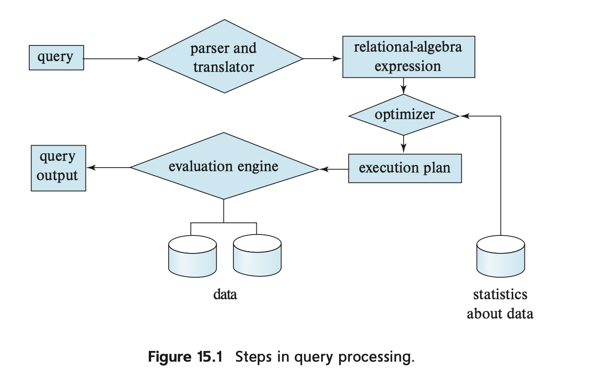

쿼리가 처리될 때는 다음과 같은 과정을 거친다.
> 1. 파싱과 변환
> 2. 최적화
> 3. 평가

파싱과 변환은 입력받은 Query의 문법을 검토하고 적절하게 관계 대수식으로 바꾸는 작업이고, 
평가는 평가 계획에 따라 계획을 실행하고, 결과를 산출하는 것이다. 

관계대수 식은 여러가지 알고리즘에 따라 실행될 수 있다. 
이때, 어떻게 알고리즘을 실행하고 처리해야 할지 주석으로 표현해야 하고 이것을, 
**평가 기본 단위**라고 한다. 
또한, 질의처리를 위한 기본 연산을 **질의 평가계획**이라고 한다. 

이에 따라, **쿼리 최적화**란,  이러한 질의 평가계획 중 **가장 적은 비용**이 드는 것을 선택하는 것을 일컫는다. 

## 쿼리 비용 계산
비용 계산에 영향을 미치는 것은 디스크 접근 속도, CPU 속도, 반응 속도 등이 있다. 
CPU 속도는 단순하게 무시하고, 반응 속도는 비용 평가에 어려움이 있으므로  
디스크 접근 속도를 효율케 하는 것에 집중하자. 

디스크 접근(disk transfer) 시간을 **$T_t$**(read/write), 
디스크 탐색(disk seek) 시간을 **$T_s$**이라고 하자.(find) 

이때, b개의 블록을 전송하고, S번의 탐색이 필요할 때 비용은 
$b * T_t + S * T_s$라고 할 수 있다.

## 선택연산(Selection)
> $T_t$: 블록 접근(전송) 시간 
> $T_s$: 디스크 탐색 시간 
> $b_r$: 레코드를 담고 있는 블록의 개수 
> $h_i$: 인덱스 트리의 높이 
> $b$: 한 블록당 레코드의 개수 

A1(linear search): 각 파일 블록을 스캔하고 모든 레코드에 대해 선택 조건을 만족하는지 검사 
Cost Estimate : $b_r * T_t + T_s$  

> A1(Linear search, 선택 조건이 key 속성인 경우) 
> Cost Estimate : $b_r * (T_t/2) + T_s$ 
> (디스크를 탐색하고, 키를 기준으로 평균적으로 1/2 정도면 데이터 블록을 찾음)

A2(clustering index[^1], key에 대한 동등 비교): 인덱스를 사용하여 동등조건을 만족하는 **하나의** 레코드 검색 
Cost Estimate : $(h_i + 1) * (T_t + T_s) $  
$$\text{인덱스 탐색 시간} = h_i \times (T_t + T_s)$$,  
$$\text{데이터 블록 접근 시간} = 1 \times (T_t + T_s)$$

A3(clustering index, non-key에 대한 동등 비교): 인덱스를 사용하여 동등조건을 만족하는 **복수** 레코드 검색 
Cost Estimate : $h_i * (T_t + T_s) + T_s + b * T_t$  
(인덱스 블록을 접근/탐색, 해당되는 데이터 블록를 탐색, 안의 레코드들을 읽는다.)

A4(보조 인덱스[^2], key에 대한 동등 비교): 보조 인덱스를 사용하여 동등조건을 만족하는 **하나의** 레코드 검색 
Cost Estimate : $(h_i + 1) * (T_t + T_s) $  

>A4(보조 인덱스, non-key에 대한 동등 비교): 인덱스를 사용하여 동등조건의 **복수** 레코드 검색  
>Cost Estimate = $(h_i + n) * (T_t + T_s)$ 
>$n$: 각 블록 당 조건에 해당되는 레코드 수 

A5(clustering index, comparison): 인덱스를 사용하여 비교조건의 복수 레코드 검색  
Cost Estimate: $h_i * (T_t + T_s) + T_s + b * T_t$ 

A6(보조 인덱스, comparison): 보조 인덱스를 사용하여 비교조건의 복수 레코드 검색  
Cost Estimate = $(h_i + n) * (T_t + T_s)$ 

**References** 
Database Systems, Abraham Silberschatz, Henry Korth and S. Sudarshan

[^1]: 클러스터링 인덱스: 인덱스를 기준으로 데이터 레코드가 정렬되어 있음. B-tree 구조를 가지는 인덱스, 검색 속도가 빠르지만 수정/삽입/삭제가 느리다. (갱신시 새로운 정렬 필요하기 때문)
[^2]: 보조 인덱스: 인덱스와 실제 데이터의 정렬 순서가 무관함. 검색 속도가 느리지만 수정/삽입/삭제가 빠르다. (갱신시 새로운 정렬이 불필요)