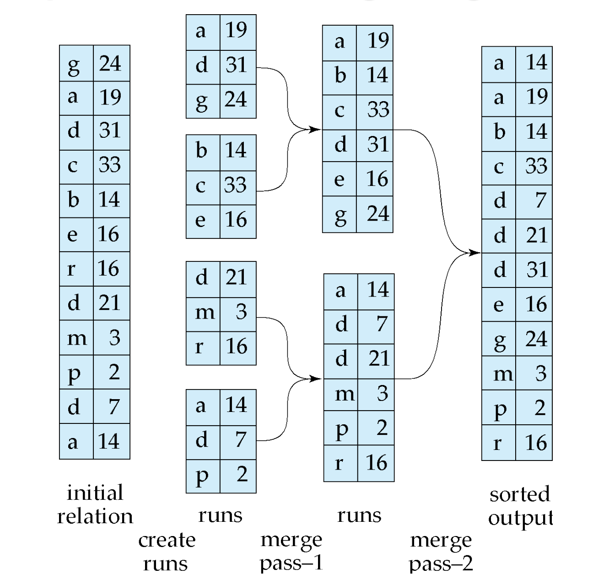

우리는 릴레이션을 만들 때, 인덱스를 만들고 그 인덱스는 릴레이션을 **정렬**된 순서로 읽을 수 있게 한다. 
릴레이션이 메모리에 모두 올라가면 퀵-정렬 같은 알고리즘을 사용할 수 있지만,  
릴레이션이 메모리에 올라가지 못하면, 다른 알고리즘을 사용해야 한다. 

이런 경우에 사용하는 알고리즘을 **외부 정렬-합병(external sort-merge)**알고리즘이라고 한다.

## Sort-Merge 알고리즘

$M$ 을 정렬을 위한 메모리에서 사용할 수 있는 블록의 개수라고 하면, 
정렬 방법은 다음과 같다.

> - Sort Runs 
> 최대 $M$블록을 릴래이션에서 읽는다. 
> 읽은 블록을 정렬하고 쓴다. 
> 릴레이션을 모두 정렬 할 때 까지 위를 반복한다. 

 

> - Merge  
> 런의 총 개수를 $M$보다 작은 $N$이라고 할때, 각 런을 메모리에 할당한다. 
> 합병할 $N$개의 Run을 각각 담을 공간을 만든다.  
> Run의 첫 번째 블록(페이지)들을 읽어서 이 입력 버퍼에 각각 채움. 
> 맨 앞 레코드들을 비교하여, 정렬 순서상 가장 앞에 오는 레코드를 선택한다. 
> 선택한 레코드를 출력 버퍼로 보냄.  
> 출력 버퍼가 가득 차면, 이 버퍼의 내용을 디스크에 쓰고 버퍼를 비운다. 
> 출력 버퍼로 보낸 레코드를 원래 있던 입력 버퍼 페이지에서 삭제. 
> 모든 입력 버퍼가 비워지면 종료 

### 정렬-합병의 비용 분석

>$b_r$ : 레코드 블록 
>$b_b$ : 한 런이 읽는 메모리내 블록의 개수 
>$M$ : 메모리 공간

초기 런의 개수는 $\frac{b_r}{M}$ 
한번의 Merge Pass에 $\lfloor M/b_b \rfloor - 1$ 개의 run을 합병할 수 있음 
따라서 전체 Merge Pass의 횟수는 $$\left\lceil \log_{\lfloor M/b_b \rfloor - 1} \left( \frac{b_r}{M} \right) \right\rceil$$. 

대부분의 패스는 **두 번**씩 데이터를 읽고 쓴다. 
그러나 pipeline에 따라 **마지막 패스**는 디스크에 해당 내용을 쓰지 않아도 된다. 
또한, 초기 **정렬 단계**에서 Run 생성을 위해 디스크를 읽고, 쓴다. 

따라서 총 블록 전송횟수는 다음과 같다. 
**$$b_r \left( 2 \left\lceil \log_{\lfloor M/b_b \rfloor - 1} \left( \frac{b_r}{M} \right) \right\rceil + 1 \right)$$ **

**탐색 비용**은 각 Run 생성에 $2 \lceil b_r / M \rceil$ 만큼 탐색,  
$2\lceil b_r / b_b \rceil$ 만큼 merge pass 당 탐색이 포함된다. 
또한, 상술했듯이 마지막에는 한번만의 읽기만 이뤄진다. 
따라서 총 탐색비용은  $$2 \lceil b_r / M \rceil + \lceil b_r / b_b \rceil \left( 2 \left\lceil \log_{\lfloor M/b_b \rfloor - 1} (b_r / M) \right\rceil - 1 \right)$$ 

**References** 
Database Systems, Abraham Silberschatz, Henry Korth and S. Sudarshan
