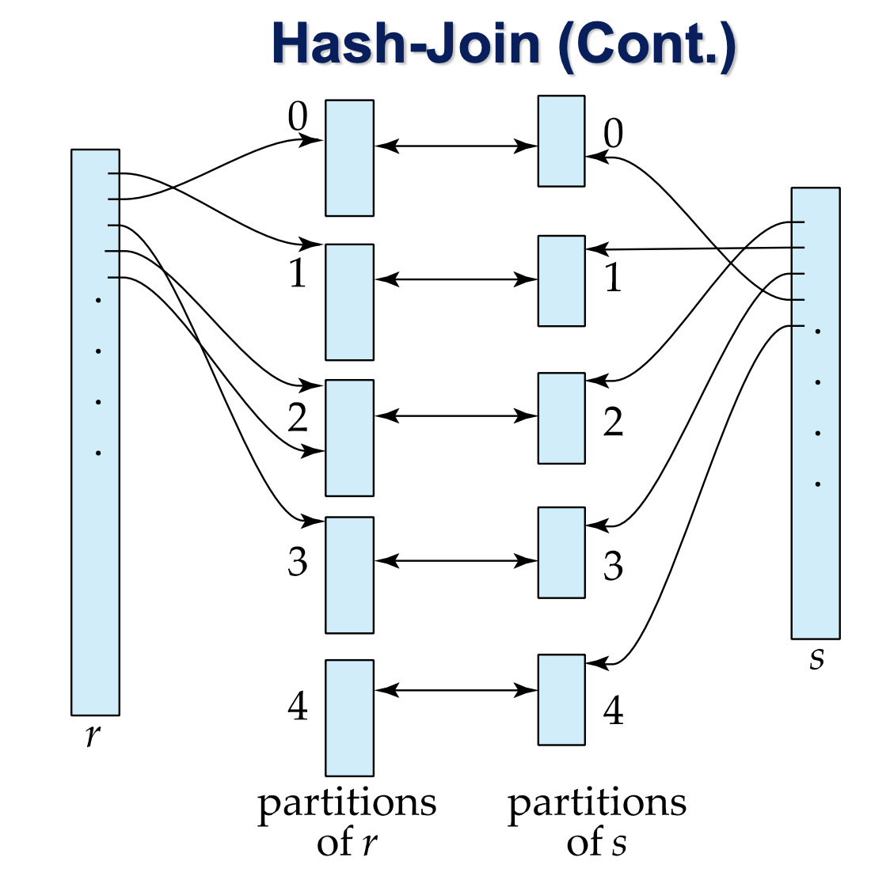

 
앞서서 정렬을 다루었다면 이번 장에서는 조인 연산에 대해 다뤄보자.

## Nested-Loop Join

$r \bowtie_{\theta} s$에서, 

```c
for each tuple tr in r do begin
    for each tuple ts in s do begin
        test pair (tr, ts) to see if they satisfy the join condition θ
        if they do, add tr • ts to the result.
    end
end
```

이때 r은 외부 릴레이션 s는 내부 릴레이션이라고 한다.<br/>
또는, r을 driving table, s를 driven table이라고도 한다.<br/>
이 알고리즘은 모든 튜플 쌍을 검사하기 때문에, 많은 비용이 든다.<br/>
각 릴레이션의 튜플의 개수를 $n$이라고 할 때, 고려해야 할 튜플은 $n_r * n_s$ 이다.<br/>

이때 필요한 조인 연산의 블록 전송횟수는 최악의 경우, **$n_r * b_s + b_r$**, 탐색 횟수는 $b_r + n_r$ 이다. <br/>
반대로 최선의 경우 (즉, 두 릴레이션을 모두 메모리에 올릴 수 있는 경우),<br/> 블록 전송횟수는  $b_r + n_r$  , 탐색 횟수는 2이다.

따라서 외부릴레이션(드라이빙 테이블)이 작을 수록 비용은 줄어든다.

## Block Nested-Loop Join
릴레이션에 대한 접근을 블록 단위로 하는 경우 접근 횟수를 줄일 수 있다. <br/>

```c
for each block Br of r do begin
    for each block Bs of s do begin
        for each tuple tr in Br do begin
            for each tuple ts in Bs do begin
                Check if (tr, ts) satisfy the join condition
                if they do, add tr • ts to the result.
            end
        end
    end
end
```

이때 최악의 경우, 블록 접근 횟수는 **$b_r * b_s + b_r$**, 탐색 횟수는 $2 * b_r $이다.<br/>
최선의 경우, 블록 접근 횟수는 $b_s+b_r$, 탐색 횟수는 $2$이다.

## Indexed Nested-Loop Join
인덱스 검색은 파일에 대한 접근을 갈음할 수 있다.<br/>
조인 비용은 다음과 같다.<br/>
**$b_r+n_r * c $**<br/>
이때 c는 r(outside table)의 인덱스에 알맞는 s(inner table)를 찾아오는 비용을 일컫는다.<br/>

예를 들어, 한 DB가 B+-tree index를 가지고 있다고 생각하자.<br/>
그렇다면 기존 접근(여기서는 block nested-loop join으로 가정한다.)보다 더 빠를 수 있다.<br/>
이것은 index로 inner table을 가져오는 것이 빠르기 때문인데,<br/>
10,000개의 데이터를 평균 20개의 엔트리를 가지는 b+-tree로 가정하면, <br/>
5번의 접근으로 레코드 탐색이 가능하기 때문이다.<br/>
($20^4 < 10000$ $so,$ $h= 4$. 트리 인덱스의 디스크 접근과 탐색에는 $h+1$의 비용이 필요하다.)

## Merge Join
합병 조인은 조인 속성을 기준으로 **먼저 정렬**한 뒤, **합병**을 진행한다.<br/>
포인터가 각 릴레이션을 가르키는 각 값을 비교하며, 동등한 값을 만났을 때 조인 결과를 생성한다.<br/>
동등조인, 자연조인과 유사하다.<br/>

비용: 블록 전송 $b_r + b_s $, 탐색에 $$$\lceil b_r / b_b \rceil + \lceil b_s / b_b \rceil$$ 

예시로 한 릴레이션이 400 블록, 메모리가 최대 읽을 수 있는 공간이 3블록, 한런에 하나의 블록을 읽는다고 하자.<br/>
앞서 sort-merge 조인의 공식에 대입해보면 런은 $400/3=134$개가 생성되고, 8개의 합병단계가 생성된다. <br/>
따라서 400*(2 * 8 + 1) 번의 블록 전송이 필요하다.<br/>
또한 탐색에는 2 * 134 + 400 * (2 * 8 - 1)번의 탐색과 기록에 추가적인 400회 탐색이 필요하다.<br/>

또 다른 릴레이션이 100 블록, 메모리가 최대 읽을 수 있는 공간이 3블록, 한런에 하나의 블록을 읽는다고 하자.<br/>
이 역시 같은 공식에 대입하면 런은 $100/3=34$개가 생성되고, 6개의 합병단계가 생성된다.<br/>
따라서 100*(2 * 6 + 1) 번의 블록 전송이 필요하다.<br/>
또한 탐색에는 2 * 34 + 100 * (2 * 6 - 1)번의 탐색과 기록에 추가적인 100회 탐색이 필요하다.<br/>
 
또한 합병에 400 + 100 = 500 회의 블록 전송과 500회의 탐색이 필요하다.

## Hash-Join


해시 함수를 통해 해시 인덱스를 **구축(build)**하고, r에 있는 튜플로 s에 있는 튜플을 **탐색(probe)**한다.<br/>


**References**<br/>
Database Systems, Abraham Silberschatz, Henry Korth and S. Sudarshan
