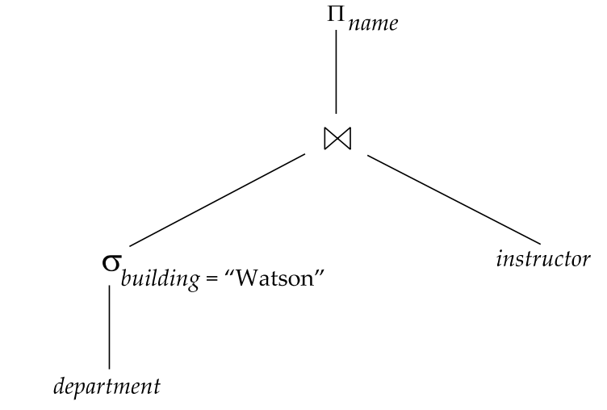

 
표현식을 어떻게 처리하는지 표현식의 평가 방법에 대해 알아본다. 
릴레이션을 평가하는 방법은 **실체화**와 **파이프라인**기법이 있다. 

## 실체화(Materialized Evaluation)
실체화 기법은 가장 하위의 연산부터 수행하여 임시 릴레이션을 고려한다. 
이를 위해 연산자 트리를 차용한다. 

일반적인 비용평가에서는 각 연산의 결과를 디스크에 쓰는 비용을 고려하지 않았다. 
그러나 이를 고려한다면 중간 결과를 디스크에 쓰는 비용까지 고려해야 한다.

## 파이프라이닝(Pipelining)
중간 결과의 수, 즉 임시파일을 줄이기 위해서는 관계형 연산을 합치는 것을 고려할 수 있다. 
조인 연산 추출(projection)연산이 순차적으로 나타난다고 생각해보면, 
조인 연산을 통한 임시 릴레이션의 결과가 추출 연산을 진행하게 된다. 
그러나 임시 릴레이션을 생략하기 위해 조인 연산과 추출 연산을 합칠 수 있다. 
이는 빠른 질의 처리와 질의 평가의 비용을 줄여준다. 
파이프라인은 두가지 방법 중 하나로 구현된다.

> ### 요구 구동 파이프라인(demand-driven/lazy pipeline)
최상위 연산자가 하위의 그것들을 당기는(pull) 형태 
시스템은 최상위 연산자에게 다음으로 출력할 튜플을 요청한다. 
상위 연산자는 하위 연산자에게 데이터를 요청.  
> 이를 위해 연산자들은 state를 가지고 있어 다음 튜플이 어디인지 기억하고 있어야 한다. 

> ### 생산자 구동 파이프라인(producer-driven/eager pipeline)
아래에서 위로 데이터를 밀어올리는(push) 형태, 요구를 기다리지 않고 즉시 생성(eager) 
하위연산자(생산자)들은 최대한 데이터를 생산하여 밀어올린다. 
>이를 위해 임시로 데이터를 저장할 버퍼를 이용 

**References** 
Database Systems, Abraham Silberschatz, Henry Korth and S. Sudarshan
