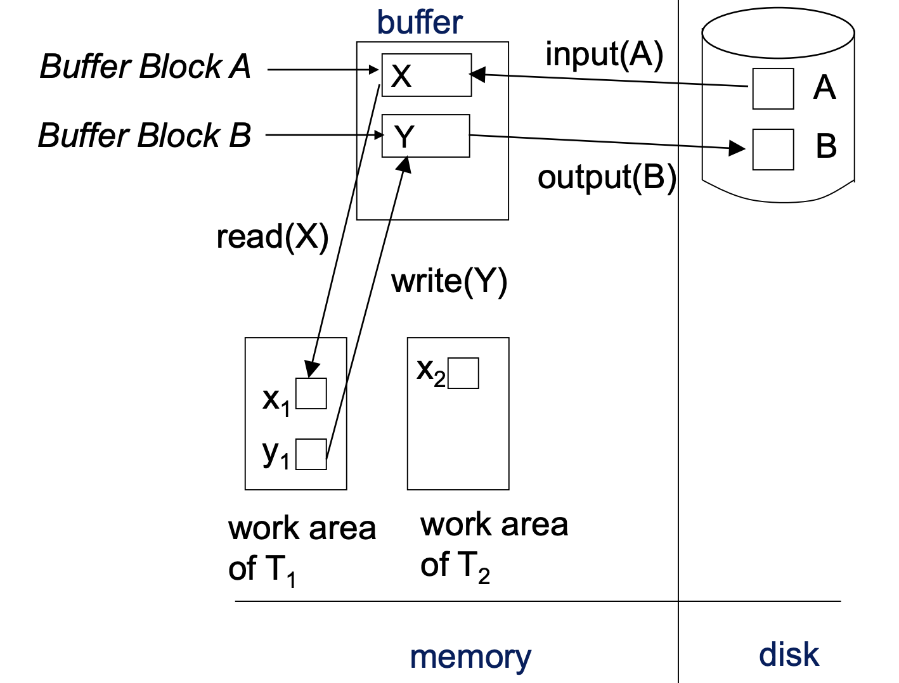

선호가 미령이한테 돈을 500만원 송금했는데,  애석하게도 보내는 와중에 은행 오류로 인해 선호의 돈만 빠져나갔다. 
미령이는 당연히 돈을 받지 못했기 때문에, 사정을 알지 못한다면 노발대발 할 수 밖에 없다. 
이를 해결하기 위한 방법은 송금을 했던 행위를 되돌리거나 어떻게든 전달하게 할 수 밖에 없다. 

이같은 상황은 트랜잭션의 원자성과 연관이 깊다. 
트랜잭션은 전부다 반영되든지, 혹은 전혀 반영되지 않아야 한다. 
이를 위해서는 어떤 명령을 수행했는지 기록을 남겨 놓아야 하는데, 가장 대표적으로 **로그**를 사용한다.

## 로그 레코드
데이터베이스의 변경 사항을 기록하기 위해 기록하는 것을 로그라고 한다. 
대표적으로 갱신 로그 레코드가 있으며 다음과 같이 구성된다. 

> <$T_i, X, V_1, V_2$> 
> $T_i$ : write를 수행한 트랜잭션의 식별자 
> $X$ : write를 수행한 데이터 항목 
> $V_1$ : write 수행 전 데이터 값 
> $V_2$ : write 수행 후 데이터 값 

트랜잭션을 위한 로그 레코드는 다음과 같다. 
> <$T_i, start$> 
> <$T_i, abort$> 
> <$T_i, commit$> 

시스템은 데이터 베이스를 변경하기 **전**에 쓰기 연산을 위한 로그 레코드를 생성하고 로그에 추가해야 한다. 
이 로그 레코드를 통해 언제든지 시스템은 데이터베이스의 로그를 이용할 수 있다.

반면, 데이터 접근 방식은 다음과 같다. 

- 물리적 블록 : 디스크상의 블록 
- 버퍼 블록 : 메모리에 임시로 상주하는 블록 

## 데이터베이스 변경
데이터베이스의 변경 기법은 지연 갱신과 즉시 갱신이 있다. 
**지연 갱신(deferred-modification)**은 커밋할 때까지 데이터베이스 수정하지 않는다. 
**즉시 갱신(immediate-modification)**은 트랜잭션을 수행하는 도중 데이터베이스를 수정한다. 

복구 알고리즘은 다음과 같은 요인을 고려해야 한다. 
> 갱신 내용이 디스크 버퍼에만 존재하고 디스크에 쓰기 전에 트랜잭션이 커밋된 경우 
> 트랜잭션이 수행 중인 상태에서 데이터베이스를 수정했지만, 다음에 실패로 인해 취소가 필요한 경우 

이를 위해 시스템은 **undo/redo** 연산을 수행한다. 

undo는 로그 레코드를 통해 이전 값으로 변경하는 연산, 
redo는 로그 레코드를 통해 새로운 값으로 변경하는 연산이다. 

### 검사점(checkpoint)
복구를 위해 로그를 전체를 탐색하는 경우 문제점이 발생할 수 있다. 
검색에 너무 많은 시간이 들고, 트랜잭션이 이미 갱신 내용을 반영했을 수도 있다. 
이를 위해 검사점(checkpoint)기법을 도입하기도 한다. 
검사점을 기준으로 모든 수정된 버퍼 블록을 디스크 블록으로 출력한다.

## 복구 알고리즘

### 트랜잭션 롤백
정상적인 상황에서 트랜잭션 롤백 과정은 다음과 같다.
> 1. 로그를 역방향으로 스캔한다. 
  로그 레코드 <$T_i, X, V_1, V_2$>에 대해서 
  데이터 항목 $X$에 $V_1$를 기록하고, **보상 로그 레코드**<$T_i, X, V_1$> 를 기록한다. 
> 2. <$T_i, start$>를 찾으면 역방향 스캔을 중단하고, <$T_i, abort$>로그를 기록한다. 

### 시스템 장애 후 복구
장애 후 복구에는 다음과 같은 과정을 거친다. 
> 1. **redo phase** 
>시스템은 마지막 검사점으로부터 **순방향**으로 로그를 탐색하며 모든 트랜잭션의 갱신 작업을 재실행한다. 
> 해당 트랜잭션이 커밋되든 취소되든 끝내지 못했던 전부 실행한다. 
>a. undo-list를 검사점을 기준으로 초기화한다. 
>b. 정방향으로 진행하여 <$T_i, X, V_1, V_2$> 형태의 로그 레코드를 재수행한다. 
>c. <$T_i, start$>로그를 만나면 해당 트랜잭션을 undo-list에 추가한다. 
>d. <$T_i, abort$> 로그나 <$T_i, commit$> 로그를 만나면 undo-lisst에서 제거한다. 
>redo phase가 종료되면 uncomplete된 트랜잭션만 undo-list에만 남게 된다. 

> 2. **undo phase** 
> 시스템은 undo-list에 있는 모든 트랜잭션을 롤백한다. 이때 로그의 **역방향**으로 진행한다. 
> a. undo-list에 포함된 트랜잭션의 로그 레코드를 찾으면 실패한 트랜잭션의 롤백과 같은 방식으로 undo를 수행한다. 
> b. undo-list에 포함된 트랜잭션의 <$T_i, start$>를 찾으면, <$T_i,abort$>를 기록하고 undo-list에서 $T_i$를 제거한다. 
> c. undo-list가 비어 있는 상태가 되면 undo phase를 종료한다.

## WAL(Write ahead Logging, 쓰기 전 로깅)
앞서 가정했던 로그 기법은, 로그 생성시 반드시 안정 저장 장치에 출력한다고 하였다.  
그러나 이러한 로그를 매번 출력하는 것은 당연히 비효율적이다. 
이를 위해 로그를 한번에 모아서 안정 저장 장치에 출력하기 위해 **로그 버퍼**에 임시저장한다. 
그러나 이런 버퍼링은 휘발성 저장 장치에 있기 때문에, 시스템에 장애 발생시 로그 레코드를 잃어 원자성을 지원하지 못할 수 있다. 
따라서 복구 알고리즘은 다음과 같은 조건을 따라야한다.

> <$T_i, commit$> 로그 레코드가 안정 저장 장치에 출력된 후에야 $T_i$는 커밋될 수 있다. 
> <$T_i, commit$> 로그 레코드가 안정 저장 장치에 출력되기 전에,  관련된 로그 레코드는 모두 안정 저장 장치에 출력되어야 한다. 
> 갱신 내용을 포함하는 데이터 블록을 출력하기 전에, 관련된 모든 레코드를 안정 저장 장치에 출력되어야 한다.

### 데이터베이스 버퍼링
트랜잭션 커밋 시에도 버퍼링이 적용된다. 
**force**정책은 트랜잭션이 커밋될 때 전부 디스크에 반영되는 것을 말한다. 
반면 **no-force** 정책은 트랜잭션이 커밋될 때 수정 사항이 전부 디스크에 반영되지 않는 것을 허용한다. 
no-force 정책은 트랜잭션이 더 빠르게 커밋될 수 있게 한다. 

**no-steal**은 트랜잭션이 동작 상태일 때는 수정한 블록을 디스크에 출력하지 않도록 한다. 
반면 **steal**은 트랜잭션이 커밋하지 않아도 수정한 블록을 디스크에 출력하는 것을 허용한다. 
no-steal은 갱신이 많아질 때, 버퍼가 갱신된 블록으로 가득차 진행하기 어려워 질 수 있으므로 주로 steal를 채택한다. 

**References** 
Database Systems, Abraham Silberschatz, Henry Korth and S. Sudarshan
