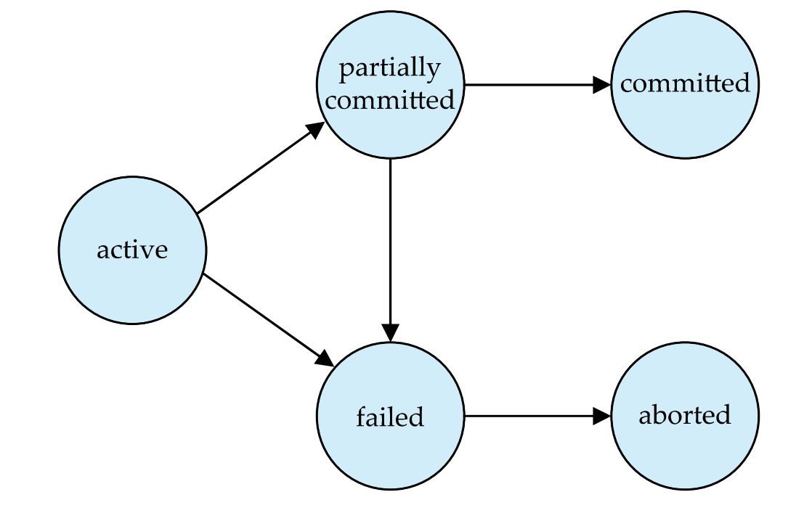

## ACID

- Atomicity<br/>
트랜잭션이 모두 정상적으로 수행 완료 되거나, 어떤 연산도 수행되지 않은 원래 상태가 되어야 한다.
- Consistency<br/>
동시에 수행되는 트랜잭션이 없는 상태에서 트랜잭션의 수행이 데이터베이스의 일관성을 보장해야 한다.
- Isolation<br/>
각 트랜잭션은 시스템에서 다른 트랜잭션이 동시에 수행되고 있는지를 알지 못하는 것과 같아야 한다.<br/>
**보통 이 고립성을 지키는 것이 주요 논제가 되기도 한다.**
- Durability<br/>
성공적으로 수행되면(Commit), 트랜잭션은 오류가 발생한다고 해도 영구적으로 반영되어야 한다.

### ACID Requirement
**원자성**을 지키기 위해 **log**라 불리는 파일에 write 연산을 하는 값을 기록한다.<br/>
트랜잭션이 정상적으로 종료하지 못하면 DBMS는 로그를 사용해 이전 값으로 복구한다. (Recovery)<br/>
위 과정을 통해 **일관성**을 보장한다.<br/>

**지속성**은 다음 중 한가지를 지키면 지속성을 보장할 수 있다.
> - 트랜잭션이 수행한 갱신을 트랜잭션이 완료되기 전에 디스크에 기록한다.
> - DBMS가 오류후 다시 시작했을 때, 실패한 트랜잭션이 갱신한 데이터를 다시 복구할 수 있을 만큼의 정보를 디스크에 기록한다.

**고립성**을 지키기 위해서는 동시에 수행되는 트랜잭션들이 예기치 않은 순서로 배치되어 비일관성을 띄는 것에 대응해야 한다.<br/>
가장 대표 적인 방법은 **순차적으로** 트랜잭션을 실행하는 것이다.
<br/>
그러나 이것은 동시수행의 성능상 이점을 포기하는 trade-off가 있다.


## Transaction State


- Active: 초기 상태, 트랜잭션의 실행 상태
- Partially Commited: 마지막 명령문이 실행된 상태
- Failed: 정상적인 실행이 더 진행될 수 없을 때
- Aborted: 트랜잭션이 **롤백(Rollback)**되고 데이터베이스가 트랜잭션 시작전으로 환원되고 난 후 
- Commited: 트랜잭션이 성공적으로 완료된 후의 상태

트랜잭션의 롤백과 중단은 로그를 유지하는 방법을 통해 이뤄진다.<br/>
**트랜잭션이 일단 커밋되면 그 트랜잭션을 Abort 하여 Rollback 불가하다.**<br/>
 -> 굳이 한다면 보상 트랜잭션을 실행해야한다. 이는 DB가 자동적으로 행하는 것이 아닌 사용자가 해야할 부분이다.

## Serializablility

트랜잭션이 하나씩 **순차적으로** 실행되도록 하면 일관성과 관련된 문제는 발생하지 않는다.<br/>
그러나 동시성을 허용한다면 두가지 이점을 얻을 수 있다. 

> - 처리율과 자원 이용률 향상
> - 대기시간 감소

앞으로 트랜잭션의 실행 순서를 **스케줄**이라고 부르자.<br/>
스케줄은 반드시 그 트랜잭션의 모든 명령어를 포함하며, 명령어는 개별 트랜잭션의 명령어 순서에 종속된다.
<br/>
한 트랜잭션 다음에 다른 트랜잭션이 실행되는 것을 **순차적인 스케줄(Serial Schedule)**이라고 부른다.<br/>
순차적인 스케줄은 n개의 트랜잭션에 대해 $n!$ 개의 스케쥴을 만들 수 있다.

하지만 동시성을 부여해보자.<br/>
동시에 여러 트랜잭션들을 수행한다고 한다면, 이는 더 이상 순차적일 필요는 없다.<br/>
따라서 여러 트랜잭션을 동시에 수행하는 경우 CPU 처리 시간은 트랜잭션 간 공유된다.<br/>

그러나 상술하였듯이, 동시성은 비일관성을 야기한다. 이를 제어하는 것은 [동시성제어](/Concurency-Control)에서 다룬다.<br/>

어떤 스케줄은 동시성과 일관성을 모두 보장하는데 이를 **직렬가능한(Serializable)** 스케줄이라 일컫는다.

### Conflict Serializability
순차적인 스케줄을 반드시 직렬가능성을 갖지만,  ~~Serial은 반드시 Serialiazble 하니...~~<br/>
트랜잭션 명령어가 동시수행되면(사실은 교차수행)되면 여러 연산의 상호작용을 파악하기 어렵다.<br/>

데이터 Q를 읽는 행위를 read(Q), 데이터 Q에 쓰는 행위를 write(Q)라고 하자.<br/>
이에 따른 다음과 같은 상황이 나올 수 있다.<br/>

> 1. A: read(Q), B: read(Q). 이때 둘의 순서는 문제가 없다. 단순 읽기만 수행하기 때문이다.
> 2. A: read(Q), B: write(Q). 이때 둘의 순서는 중요하다. 순서에 따라 읽는 데이터 Q의 값이 다르기 때문이다.
> 3. A: write(Q), B: read(Q). 위와 동일하다.
> 4. A: write(Q), B: write(Q). 이때 둘의 순서에 따라 마지막에 write되는 값만 DB에 남으므로 순서는 중요하다. <br/>

그러므로 1의 경우에만 실행 순서가 상관이 없다는 것을 알 수 있다. <br/>
이외의 경우는 모두 순서가 중요한데, 이를 두 트랜잭션이 **충돌(Conflict)**하고 있다고 한다.<br/>
당연하게도, 서로 다른 데이터에 접근하는 경우 충돌이 발생하지 않는다.<br/>

A, B가 스케줄 S1에 있는 명령어이고,이것이 충돌을 일으키지 않는다고 하자.<br/>
그렇다면 이들의 순서를 바꿔, 스케줄 S2 역시 S1과 같은 결과를 가질 것이다.<br/>
(충돌하지 않는 명령어들은 결과에 영향을 주지 않기 때문이다.)<br/>
이때 두 스케줄 S1, S2는 **충돌 동등(conflict equivalent)**하다고 한다.<br/>

또한 이는 확장 되어, 스케줄 S가 어떤 직렬 스케줄과 충돌 동등하다면 **총돌 직렬가능(conflict serialiazable)**하다고 한다.<br/>


>**Precedence Graph**<br/>
>충돌 직렬 가능성을 검사하기 위해서 **우선순위 그래프(precedence graph)**를 차용해보자.<br/>
>그래프는 트랜잭션을 의미하는 정점과 트랜잭션 간 충돌을 의미하는 간선으로 이루어져 있다.<br/>
>(read(Q)-> read(Q)는 배제한다는 것을 잊지말자.)<br/>
><br/>
>스케줄 S에 대한 우선순위 그래프가 사이클(cycle)을 가진다면, 이것은 충돌 직렬 가능하지 못하다.<br/>
>사이클을 검사하기 위해서는 우선순위 그래프를 그린 후 탐색알고리즘을 거치는데, <br/>이는 $O(n^2)$의 시간복잡도를 갖는다.
<br/>

## View Equivalent/View Serialiazble
뷰 동등성(View Equivalent)은 다음과 같은 조건을 만족해야 한다.
> 1. 스케쥴 S1의 한 트랜잭션이 초기의 Q에 대해 read(Q)를 하였다면, <br/>S2역시 트랜잭션이 초기의 Q에 대해 read(Q)를 해야한다.
> 2. 스케쥴 S1의 한 트랜잭션이 read(Q)를 하고 그 값이 다른 트랜잭션이 write(Q)를 한 것이었다면, <br/>
> 스케쥴 S2의 한 트랜잭션 역시 read(Q)를 하고 그 값이 다른 트랜잭션의 write(Q) 값이어야 한다.
> 3. 각 데이터 항목에 대해 스케줄 S1에서 마지막 write(Q)를 한 트랜잭션은<br/>
> 스케줄 S2에서도 해당 트랜잭션이 마지막 write(Q)를 해야한다.

스케줄 S1이 직렬 스케쥴 S2과 뷰 동등하다면 **뷰 직렬가능(View Serializable)**하다고 한다.
<br/>
**모든 충돌 직렬가능한 스케줄을 뷰 직렬가능하다.** <br/>
<br/>
뷰 직렬가능성은 충돌 직렬가능성과 달리 우선순위 그래프로 알 수 없다.<br/>
이를 파악하는 알고리즘은 NP-완전에 속한다.<br/>

## Recoverable
어떤 스케줄이 **회복가능(recoverable)**하려면 다음과 같은 조건을 만족해야 한다.
> 트랜잭션 T1이 데이터 Q에 대해 write(Q)를 하고, T2가 해당 데이터에 대해 접근한다면,
> T1은 T2 보다 먼저 commit이 이루어져야 한다.

### Cascadeless schedules
- **연쇄 롤백(Casecading Rollbacks)**
한 트랜잭션의 실패(failed)로 abort가 일어났을 때, 다른 트랜잭션의 연쇄적인 rollback이 일어나는 것.<br/>
(이때 다른 트랜잭션은 아직 commit 되지 않아 recoverable하다고 가정하자.)<br/>

이를 발생하지 않는 스케줄을 Casecadeless Schedule이라고 한다.<br/>
다음을 만족하는 스케줄을 Casecadeless Schedule이라고 한다.<br/>
> T1이 write한 데이터를 T2가 read한다면, T2가 읽기 전에 T1은 커밋되어야 한다.<br/>
따라서 모든 Casecadeless Schedule은 Recoverable하다.<br/>

엄격(strict): 커밋되지 않은 데이터에 대해 read,write모두 불가<br/>

관계성은 다음과 같다.<br/>
```
엄격(Strict)
   ⊂
비연쇄적(Cascadeless)
   ⊂
회복가능(Recoverable)
   ⊂
모든 스케줄
```

## Isolation Level
상술했듯이 직렬가능성은 일관성과 고립성을 보장하는 좋은 수단이지만, 동시성을 거의 보장하지 못한다.<br/>
따라서 sql은 다음과 같은 고립성 수준을 통해 동시성과 일관성의 trade-off를 조절할 수 있게 해준다.

>Serializable(직렬 가능)
>Repeatable Read(반복 가능한 읽기)
>Committed Read(커밋된 데이터 읽기)
>Uncommitted Read(커밋되지 않은 데이터 읽기)
<br/>
```
set transaction isolation level [serializable]
```
위 고립성 수준들이 해결하는 문제는 다음과 같다.<br/>
- Dirty Read(오손 읽기): Uncommited Read에서 발생, 커밋/중단되지 않은 트랜잭션이 데이터 항목에 덮어쓰는 것을 허용하지 않는다.
- Unrepeateable Read(반복할 수 없는 읽기): Committed Read이하에서 발생, **update**로 인해 실행 전후 결과가 다를 수 있다.
- Phantom Read(유령 읽기): Repeatable Read 이하에서 발생, **insert**로 인해 보이지 않았던 데이터(row)가 보일 수 있다.

이를 구현하는 방법에 대해서는 동시성 제어에서 다룬다.

**References**<br/>
Database Systems, Abraham Silberschatz, Henry Korth and S. Sudarshan